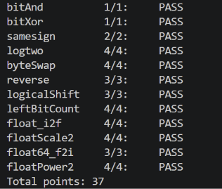

# datalab 报告

姓名：赵建滨

学号：2025201874

| 总分 | bitAnd | bitXor | samesign | logtwo | byteSwap | reverse | logicalShift | leftBitCount | float_i2f | floatScale2 | float64_f2i | floatPower2 |
| --- | --- | --- | --- | --- | --- | --- | --- | --- | --- | --- | --- | --- |
| 37 | 1 | 1 | 2 | 4 | 4 | 3 | 3 | 4 | 4 | 4 | 3 | 4 |

test 截图：



## 解题报告

### 亮点

1. float_i2f
2. leftBitCount
3. byteSwap

### float_i2f

```c
sign = x & 0x80000000;

if (sign)
    ux = ~x + 1;
else
    ux = x;

exp = 158;

while (!(ux & 0x80000000)) {
    ux = ux << 1;
    exp = exp - 1;
}

frac = (ux >> 8) & 0x7fffff;
lost = ux & 0xff;
```

这道题需要将整数转换为单精度浮点数的位级表示。首先记录符号位，并将负数转换为其绝对值。之后不断左移 `ux`，直到最高有效位移动到 bit31，同时递减阶码。这样可以将有效数字的位置固定下来，bit30~bit8 对应 fraction，低 8 位用于判断舍入。

舍入采用 round-to-even：大于一半时进位；恰好等于一半时，只有当前最低保留位为 1 才进位。最后还需要检查 fraction 进位是否影响 exponent。最初的实现根据最高有效位的位置分别计算移位量，操作数较多；改为将最高有效位统一移动到 bit31 后，减少了操作数并满足 Max ops 限制。

### leftBitCount

```c
n = (!((x >> 16) ^ (~0))) << 4;
count = count + n;
x = x << n;

n = (!((x >> 24) ^ (~0))) << 3;
count = count + n;
x = x << n;
```

这道题使用分段检查的方式统计最高位开始连续出现的 1。首先检查最高 16 位是否全部为 1，如果是，则将计数增加 16 并把 `x` 左移 16 位；之后按照相同的思路依次检查 8、4、2、1 位。

相比逐位检查，这种方法每次可以处理一段已经确定的位。对于 `x = -1` 的情况，还需要保证最终能够正确得到 32。

### byteSwap

```c
diff = ((x >> (n << 3)) ^ (x >> (m << 3))) & 0xff;

return x ^ (diff << (n << 3))
         ^ (diff << (m << 3));
```

首先用 `(n << 3)` 和 `(m << 3)` 得到两个 byte 的起始位，通过异或得到两个 byte 中不同的位，并使用 `0xff` 只保留一个 byte。

之后将 `diff` 分别移动到原来的两个位置，再与 `x` 异或。相同的位不会改变，不同的位会被翻转，因此可以直接完成两个 byte 的交换。相比先提取两个 byte、清零原位置再写回的方法，这种实现使用的操作数更少。

## 反馈/收获/感悟/总结

这个 lab 对我来说难度还是很大，但是做完之后也有不少感悟。去年学习程序设计时就讲过 int、unsigned 和 float，当时老师也比较详细地讲过这些类型，但更多是知道它们怎么使用。直到这次 datalab 真正去观察和操作每一位，思考每一位有什么作用、能够表示什么，以及不同的位运算会怎样改变结果，我才对这些知识有了更深入的理解。尤其是在处理补码和浮点数表示的过程中，我感觉自己第一次真正理解了这些数据在计算机中是如何存储和运算的。

## 参考的重要资料

无。
